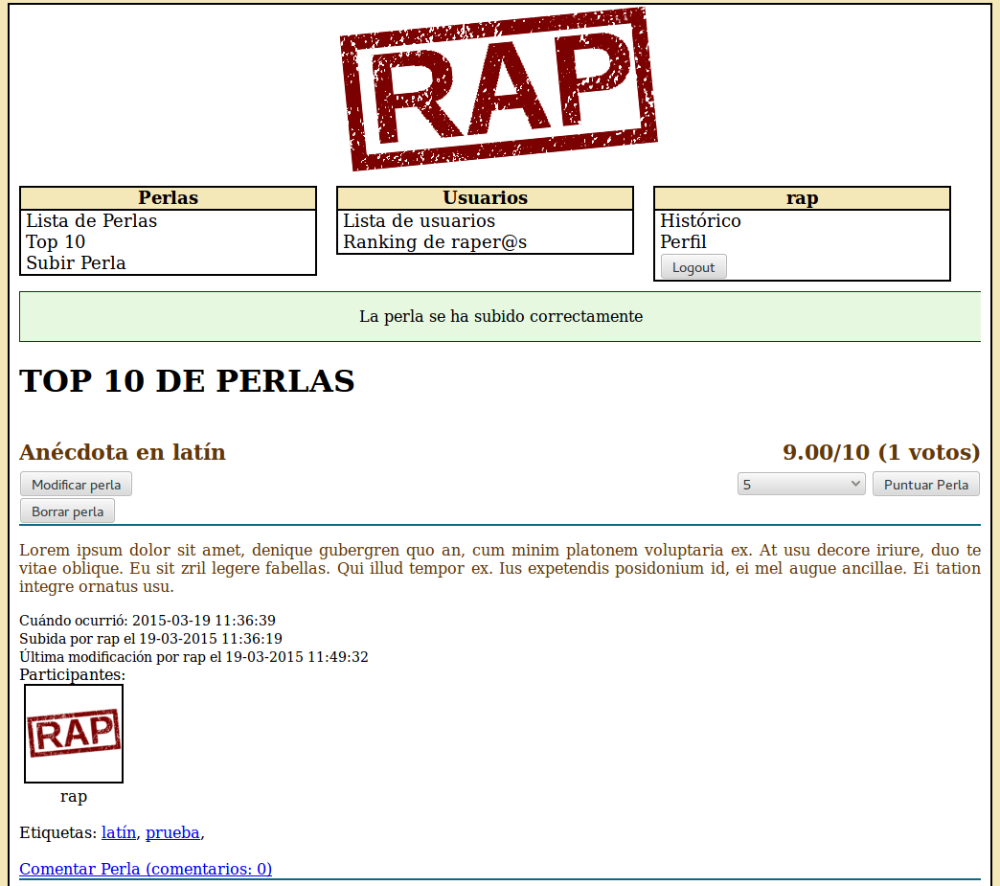

# RAP - Real Academia de las Perlas



La RAP es una web privada donde un grupo de amigos puede subir sus "perlas" (textos o imágenes): frases célebres, conversaciones legendarias, situaciones surrealistas... .
Este repositorio contiene todo el código necesario para montar una RAP privada y extenderla si se desea.

## Estado actual

La RAP es un proyecto **inactivo y potencialmente inseguro para su uso en producción**. El proyecto puede construirse desde código y obtener un sitio web funcional, pero se desarrolló como un proyecto didáctico y no cuenta con garantías de seguridad para su uso público.

## Construcción

### Instalación de dependencias

1. Instalar [XAMPP](https://www.apachefriends.org/es/index.html)


### Descarga e inicialización del repositorio

1. Clonar este repositorio en local
 ```
 git clone git@github.com:moisesjbc/rap
 ```

2. Acceder al directorio descargado.
 ```
 cd rap
 ```

3. Inicializar submodulos
 ```
 git submodule init
 git submodule update
 ```

### Instalación

#### a) Instalación manual (en localhost -testeado en Ubuntu 14.04- y en servidor remoto)

1. Iniciar XAMPP.

2. Acceder al panel de control de phpmyadmin (http://*host*/phpmyadmin).

3. Crear una base de datos e importar la estructura desde el fichero "bd/bd-rap.sql".

4. Crea un usuario MySQL con permisos INSERT, UPDATE, SELECT y DELETE sobre la base de datos anterior.

5. Crear uno o más usuarios en la base de datos anterior (nombre + contraseña).
	- (*) Las contraseñas deben guardarse codificadas en MD5. las contraseñas se pueden codificar en la página siguiente: http://pajhome.org.uk/crypt/md5/

6. Abandonar el panel de control de phpmyadmin.
 
7. Copiar la carpeta "web" en el servidor web, renombrándola a gusto. En los siguientes pasos nos referiremos a la nueva ruta como *web*.

8. Cambiar el propietario de *web*.
 ```
 sudo chown -R daemon:daemon /opt/lampp/htdocs/rap/ 
 ```

9. Modificar el fichero *web*/php/config/bd.php con los datos de conexión de la base de datos y usuario anteriores.

10. Modificar la variable "DIR_WEB" el fichero *web*/php/config/rutas.php para que apunte al directorio donde se aloja la RAP.


#### b) Instalación automática (sólo en localhost)

1. Acceder al directorio de instalación.
 ```
 cd install
 ```

2. Ejecutar el script de instalación y seguir instrucciones.
 ```
 sudo ./install_localhost.sh
 ```

## Notas

- Si se trabaja en local, al intentar acceder a "localhost/phpmyadmin" puede surgir un mensaje de error del tipo "Acceso prohibido! XAMPP nuevo concepto de seguridad: [...]". Este "error" lo solucioné en mi caso siguiendo las indicaciones del siguiente enlace: http://stackoverflow.com/questions/11630412/phpmyadmin-xampp-error
